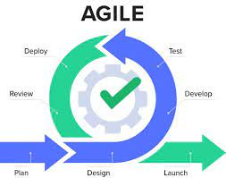

## User Interface Frameworks
Have you ever coded a basic website with raw HTML and CSS? Have you ever struggle on centering a div in the center of the page? It could never be the same after using user interface frameworks. Some of the popular frameworks are Bootstrap, Semantic UI, and Materialize CSS. The benefits of UI frameworks are not limited to cross-browser compatibility, time efficiency, and consistency. Maintaining consistency in coding is important especially when working in a team-setting. 

Agile Project Management
Agile project management is essential in larger project as its mainly use to keep the project organized. While working on the group assignment, Taste Technologist it was helpful to have a project board that keep tracks of the issues and team’s progress. Besides from issues management, it would be helpful to assign a specific person to approve pull request to prevent merge conflicts. It would be troublesome if multiple people try to update the main branch at the same time which can affect production.
