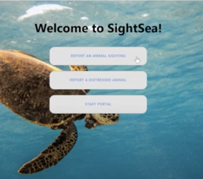

## Inspiration
Allowing non-profits to more efficiently use of volunteers is always important. For this project, we designed a user-friendly and cross-platform application that will provide beachgoers with a streamlined system to report native animal sightings to HMAR.

## What it does
SightSea allows for anyone to submit reports form either IOS or Android devices. There is also a web application that allows for administrators and dispatchers to verify the incoming reports. From IOS and Andriod you are able to see the verified reports.

## How we built it
We used react-native to build a cross-platform application. We did this using node, expo for development and testing, and GitHub for version control.

Check out the video [demo] (https://devpost.com/software/sightsea)!
