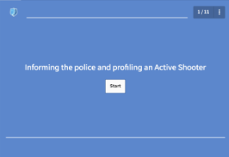

This was a semester long project for Navy to revamp their Active Shooter rediness protocols and training. After performing marketing research and adopting the business model, the team had developed a solution that could bridge the gaps in the current systems. Our final solution was an entirely new training system to prepare employees for a crisis situation, including interactive modules, videos, and quizzes.  

Check out the [interactive modules](https://www.youtube.com/watch?v=e6q92fy6ups)!
