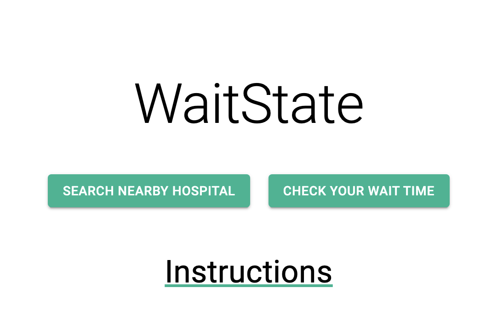

Meteor-based web application aiming to solve the issue of vague hospital emergency room wait times. Patients will be able to make informed decisions about which hospital they go to by checking emergency room wait times before hand.

Deployed website can be found on: [WaitState](https://waitstate.meteorapp.com/)

Development can be found on: [Github](https://github.com/WaitState/WaitState)

